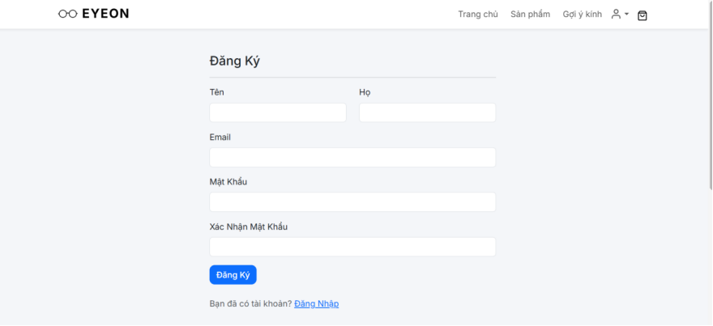
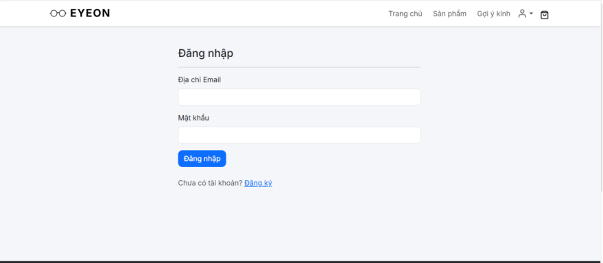
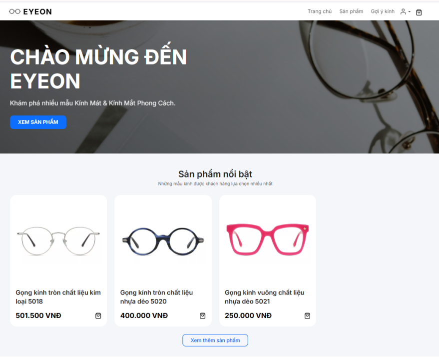
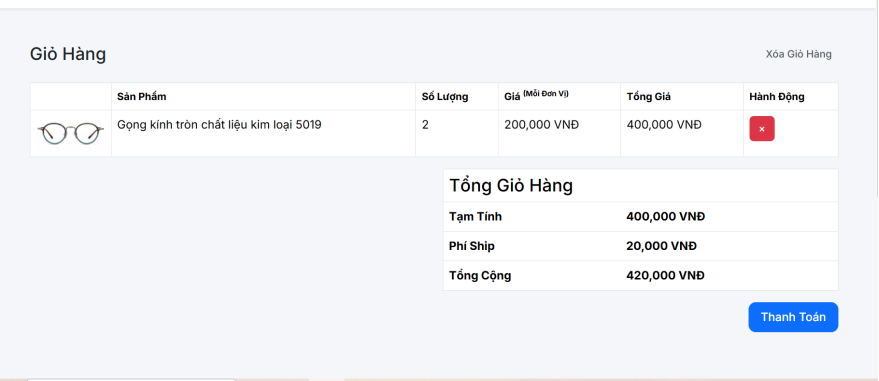
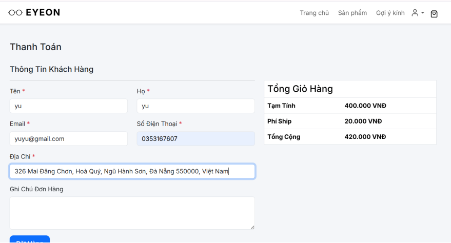

# 🕶️ AI Eyeglasses Store

## Introduction
AI Eyeglasses Store is an AI-powered eyewear e-commerce website that integrates face shape recognition and virtual try-on technology to help users choose eyeglasses that best suit their facial features.

The system combines traditional online shopping with Artificial Intelligence, providing a more personalized and interactive shopping experience.

---

## Features

### Customer
- User authentication (register, login, logout)
- View product list and product details
- Search eyeglasses by product name
- Shopping cart management (add, update, remove)
- Checkout with Cash on Delivery (COD)
- View order history and order details
- Upload face image for AI face shape recognition
- Receive eyeglasses recommendations based on face shape
- Virtual eyeglasses try-on

### Admin
- Admin authentication and dashboard
- Product management (add, edit, activate/deactivate)
- Order management (view orders, update order status)
- User management

---

## System Implementation Results

### Register Screen

*Figure 3.1 Register screen*

The registration screen allows users to create a new account by entering basic information such as full name, email, password, and password confirmation.

---

### Login Screen

*Figure 3.2 Login screen*

The login screen allows users and administrators to access the system using their registered credentials.

---

### Home Screen

*Figure 3.3 Home screen*

The home screen displays banners, featured products, search functionality, and product categories for easy navigation.

---

### Product Page

*Figure 3.4 Product page*

This page displays all available eyeglasses with images, names, prices, and availability.

---

### Product Detail Page

*Figure 3.5 Product detail page*

The product detail page provides detailed information including product description, price, images, reviews, and add-to-cart functionality.

---

### Glasses Suggest Page

*Figure 3.6 Glasses suggest page*

Based on the detected face shape, the system recommends suitable eyeglasses models to the user.

---

### Face Shape Recognition Page

*Figure 3.7 Face shape recognition page*

Users upload a facial image, and the AI model classifies the face shape into predefined categories such as oval, round, square, heart, or oblong.

---

### Virtual Try-On Page

*Figure 3.8 Virtual Try-On page*

The virtual try-on feature allows users to preview eyeglasses directly on their facial images for a more realistic shopping experience.

---

### Cart Page

*Figure 3.9 Cart page*

The cart page allows users to manage selected products, update quantities, and view the total order amount.

---

### Checkout Page

*Figure 3.10 Checkout page*

Users enter shipping information, choose a payment method, and confirm their orders on this page.

---

### Order Page

*Figure 3.11 Order page*

This page displays the list of orders placed by the user along with order status and total amount.

---

### Order Detail Page

*Figure 3.12 Order detail page*

The order detail page shows detailed information about products, quantities, prices, and shipping status.

---

### Admin Home Page

*Figure 3.13 Admin home page*

The admin dashboard provides an overview of users, products, and orders in the system.

---

### User Management Page

*Figure 3.14 User management page*

Administrators can view, add, edit, or delete user accounts on this page.

---

### Product Management Page

*Figure 3.15 Product management page*

This page allows administrators to manage product information including name, price, images, and descriptions.

---

### Order Management Page

*Figure 3.16 Order management page*

Administrators can view order details and update order statuses to ensure accurate order processing.

---

## Technology Stack
- PHP – Backend web development
- Python (Flask) – AI service and API
- CNN (MobileNetV2) – Face shape recognition model
- MySQL – Relational database
- HTML, CSS, JavaScript – Frontend
- OpenCV / Dlib – Image processing and facial landmark detection

---

## Project Purpose
This project applies Artificial Intelligence to an eyewear e-commerce system, improving user experience through personalized recommendations and virtual try-on functionality.
